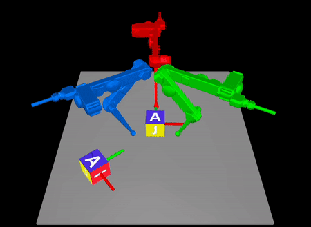
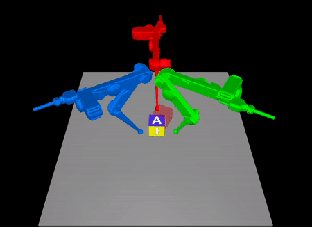

## Task-Driven Hybrid Model Reduction for Dexterous Manipulation


This is the source code for the paper ***Task-Driven Hybrid Model Reduction for Dexterous
Manipulation***, submitted to _IEEE Transactions on Robotics_, 2022.


<p float="left">


</p>


The preprint is accessible at [coming soon]\
A webpage for this work is at [coming soon]

---

### Code Structure
- **[planning](./planning)**: optimal control solvers
    * **`MPC_LCS_R.py`** LCS-based MPC solver
- **[models](./models)** : dynamics models
    * **`LCS.py`**: generic linear complementarity system (LCS)
    * **`Linear.py`**: generic linear models (not used)
    * **`NN.py`**: generic neural network models (not used)
- **[env](./env)**: environments
    * **[gym_env](./env/gym_env)**: Three-Finger Manipulation MuJoCo Environment
        * **[mujoco_core](./env/gym_env/mujoco_core)**: core gym API modules (independent of mujoco-py)
        * `trifinger_continuous.py`: full Three-Finger Manipulation environment
        * `trifinger_quasistatic_ground_continuous.py`: environment  for cube moving (manipulation task 1 in the paper)
        * `trifinger_quasistatic_ground_rotate_continuous.py`: environment  for cube turning (manipulation task 2 in the paper)
    * **[util](./env/util)**: some utility functions for the env
- **[diagnostics](./diagnostics)**: visualizer of models or debugger
    * `lcs_analysis.py`:  utilities for analyzing LCS models
    * `vis_mode.py`: utilities for plotting and visualizing learned results, trajectories, etc.
- **[util](./util)**: saver, loader, and logger APIs
    * `buffer.py`: defined class for dealing with Rollout Buffer
    * `logger.py`: APIs for saving and loading data
    * `optim_gd.py`: implementation of different gradient descent algorithms
    * `trajectory_loss.py`: some loss functions that deal with trajectories
      <br/><br/>
- **[examples](./examples)**: different executable scripts that are ready to run (detailed below). Note that each script  closely corresponds to the experiment presented in the paper.

---

### 2. Important Dependencies and Note
- [CasADi](https://web.casadi.org/get/)
- [MuJoCo Python Bindings](https://pypi.org/project/mujoco/)

The codes have been tested and run smoothly with Python 3.9 on MacBook Pro (Apple M1 Pro)\
**Before run examples, you may want to add the project directory to your python path.**

---

### 3 **Model Reduction for Synthetic Hybrid Systems (Section VI in the paper)**

#### **[examples/lcs/lcs_example1](./examples/lcs/lcs_example1)**: Illustration of Learning Progress (see Section VI.C.1): 

Run script
```
$ python3 examples/lcs/lcs_example1/lcs2d_***.py
```

with different scripts

- `lcs2d_run.py`: the main learning script
- `lcs2d_plot_loss***.py`: plot the learning curves from the saved data
- `lcs2d_analysis.py`: generate and save the phase portrait data for each learning iteration
- `lcs2d_plot_phase_***.py`: plot the phase portrait at each learning iteration (see Fig. 2 in the paper)
- `lcs2d_plot_anlaysis_rand***.py`: analyze the full-order hybrid system with random policy

#### **[examples/lcs/lcs_example2](./examples/lcs/lcs_example2)**: High Dimensional Examples (see Section VI.C.2)

Run script

```
$ python3 examples/lcs/lcs_example2/***.py
```

with different scripts

- `single_run.py` or `multiple_run.py`: the main learning script for single trial or multiple trials
- `***_plot_loss.py`: plot the learning curves from the saved data
- `single_plot_loss.py`: plot the reduced-order mpc policy rollout (see Fig. 3 in the paper)
- `multiple_analysis_comp_***.py`: analyze and compare the learned reduced-order MPC policy versus random policy (see Table II in the paper)

#### **[examples/lcs/lcs_example3](./examples/lcs/lcs_example2)**: Effect of Hyperparameter Settings (Section VI.D)

Run script

```
$ python3 examples/lcs/lcs_example3/***.py
```

with different scripts

- `run_buffer_size.py`: learn by varying buffer size
- `run_mpc_horizon.py`: learn by varying mpc horizon
- `run_new_rollout.py`: learn by varying number of new rollouts
- `run_trustregion.py`: learn by varying trust region parameter
- `plot_param.py`: plot the learned results (see Fig. 4 in the paper)

---

### 4 **Three-Finger Dexterous Manipulation (see Section VII in the paper)**

#### 4.1 [examples/trifinger_task1](./examples/trifinger_task1): Cube Turning Manipulation Task (see Section VII.C)

Run the main learning script:

```
$ python3 examples/trifinger_task1/run_training.py
```

If you want to render the environment during its on-policy rollout, go to Line 180: 

```
$ rollout = rollout_mpcReceding(env=env, rollout_horizon=rollout_horizon, mpc=mpc, mpc_aux=dyn_aux_guess, mpc_param=mpc_param, render=False)
```
and set the argument `render=True`.


After learning, run other scripts 

```
$ python3 examples/trifinger_task1/******.py
```
with 

- `run_vis_trained.py`: test the learned reduced-order LCS-based MPC controller on the Three-Finger Manipulation system for Cube Turning task
- `show_curves`: plot the learning curves and print some other stats (see Fig. 6 and Table III in the paper)
- `show_disturbance`: test the robustness of the learned reduced-order MPC controller (see Table III in the paper)
- `show_hybrid_details`: show the correspondence between mode activation in LCS and physical interaction (see Section VII.C.2 in the paper)
- `show_comp_lam`: learn the reduced-order LCS with different dimension of lambda (see Section VII.E.1)
- `show_comp_curve`: plot the learned results for the reduced-order LCS with different dimension of lambda (see Fig. 12 in the paper)


#### 4.2 [examples/trifinger_task2](./examples/trifinger_task2): Cube Moving  Manipulation Task  (see Section VII.D)  

Run the main learning script:

```
$ python3 examples/trifinger_task2/run_training.py
```

If you want to render the environment during its on-policy rollout, go to Line 190: 

```
$ rollout = rollout_mpcReceding(env=env, rollout_horizon=rollout_horizon, mpc=mpc, mpc_aux=dyn_aux_guess, mpc_param=mpc_param, render=False)
```
and set the argument `render=True`.


After learning, run other scripts 

```
$ python3 examples/trifinger_task2/******.py
```
with 

- `run_vis_trained.py`: test the learned reduced-order LCS-based MPC controller on the Three-Finger Manipulation system for the cube moving
- `show_curves`: plot the learning curves and print some other learning stats information (see Fig. 8 in the paper)
- `show_stats`: print some key results for the learned reduced-order LCS (see Table VII in the paper)
- `show_disturbance`: test the robustness of the learned reduced-order MPC controller (see Table VII in the paper)
- `show_hybrid_details`: show the correspondence between mode activation in LCS and physical interaction (see Section VII.D.2 in the paper)
- `show_strategies`: show different manipulation strategies generated by the learned reduced-order LCS (see Section VII.D.3 in the paper)

----

### 5 Citation 
coming soon...


